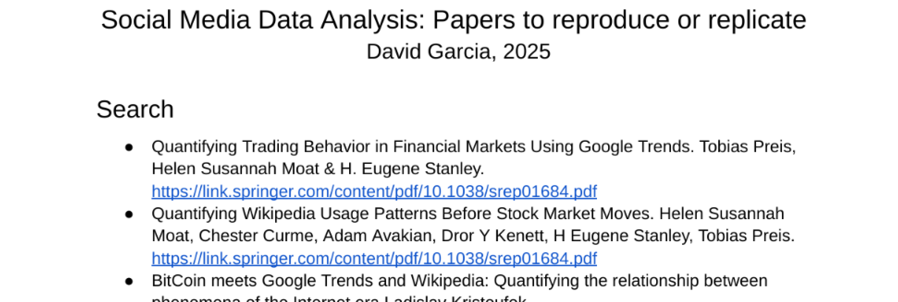
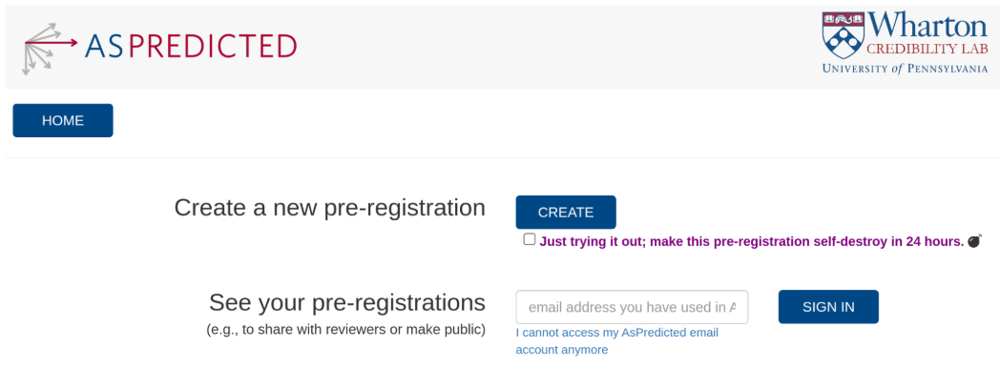

```{r xaringan-themer, include=FALSE, warning=FALSE}
#This block contains the theme configuration for the CSS lab slides style
library(xaringanthemer)
library(showtext)
style_mono_accent(
  base_color = "#5c5c5c",
  text_font_size = "1.5rem",
  header_font_google = google_font("Arial"),
  text_font_google   = google_font("Arial", "300", "300i"),
  code_font_google   = google_font("Fira Mono")
)
```

```{r setup, include=FALSE}
options(htmltools.dir.version = FALSE)
```

layout: true

<div class="my-footer"><span>David Garcia - Social Media Data Analysis</span></div> 

---

# So Far

- Search behavior and future orientation

- Social Impact Theory  

- Social trends: the Simmel effect

- TODAY: How to plan a social media data analysis project

- Next Block 3: Text in social media

- Next Block 4: Networks in social media

---

# Outline

## 1. Recap on course formalities

## 2. Intro to projects in SMDA

## 3. Evaluation criteria

## 4. General guidance

---


# Course grading

## Lecture part (6 ECTS)
- The lecture part is graded based on individual projects
- The final grade of the lecture part is based only on the final report (5-1)
- You will have opportunities to present ideas and results but these are **ungraded**
- To submit a project for the lecture part **if you pass the exercises part**

---
# Course grading

## Exercises part (3 ECTS)
- The exercises part of the course has **its own grade (3 ECTS)**
- Each assignments counts 25% of the final exercises grade
- To pass, you need 50% of the total assignment points
- The final assignment grades increase one 0.33 step for 5% of the total grade

You can take the exercises part only but not the lecture part only (you need to pass the exercises to get the lecture grade)

The exercises part can be used for the coding and scripting module (then considered ungraded for the final grade)

---

# Course objectives

After this course, you should be able to:
- understand a wide variety of techniques to retrieve **digital trace data from online platforms**
- store, process, and summarize online data for **quantitative analysis**
- perform **statistical analyses** to test hypotheses, derive insights, and formulate predictions
- **interpret** the results of data analysis with respect to testable **theories of human behavior**
- understand the **limitations** of observational data analysis with respect to data volume, statistical power, and external validity

A standalone project is the best way to work towards these objectives. In Data Science practice, **you will rarely have someone who tells you what to do.**

---
# Intro to projects in SMDA

## 1. Recap on course formalities

## *2. Intro to projects in SMDA*

## 3. Evaluation criteria

## 4. General guidance

---
# Evaluation as final projects

- **The lecture part has a project-based evaluation**

- Project grade is solely based on final project report. Any other interaction or pitches are to help you, not as part of the grading

- **Project concept: Illustrating what you have learned during the course**
  - No need to cover all methods in the course, but at least some
  - Need to reflect on how project relates to content of the lectures: theories, limitations, examples from research, etc
  - Methodological standards comparable to the course, e.g. bootstrapping, permutation tests, visualization quality, etc
  

---

# Three project paths

- A) **Replicating a previous paper**
  - Starting from a research article, collect your own dataset to address the same research question
  - No need to cover the full paper - consider course size


- B) **Reproducing a previous paper**
  - Starting from the data shared by the authors of a paper, code your analysis
  - More analysis expected than on replication path


- C) **Proposing your own idea**
  - Be careful about data availability, formulation of research questions, measurement validity...
  - A more exciting path but also one that can be harder

None of these paths has a higher expected grade, they are all equally valid.

---
# Project report structure

1. **Motivation:** What question(s) do you seek to answer and why?

2. **Background:** Who has worked on this before? How does this project relate to the content covered in the lectures and tutorials?

3. **Data:** Describe the data and any resources used to collect it. Explain how you filtered data, normalized values, computed additional variables, etc.

4. **Methods:** Detail the data analysis and statistical methods. Justify your choice.

5. **Results:** Show the results of statistical analyses and visualizations that assess the question(s).

6. **Discussion:** Evaluate answers to the question and their reliability. Assess limitations and critique. Relate to results from other work or replicated paper

---

# Papers to reproduce or replicate
.center[]

## https://tinyurl.com/mt9hu6wd

.center[**Start reading soon and assess how and what you can do!**]

---

# Evaluation criteria

## 1. Recap on course formalities

## 2. Intro to projects in SMDA

## 3. *Timeline and grading criteria*

## 4. General guidance


---


# Projects Timeline

- **Strong recommendation:** Open a thread in Github Forum with a short description of your project: https://github.com/SMDA-2025/forum/discussions
  - Mention questions, data plan, and methods you want to apply
  - Ask questions and you will get input from colleagues and lecturers


- **Project pitches and feedback session: 16.07.2025**
  - The best session to discuss your ideas and plans: you can bring slides
  - Don't leave your thinking for the last minute!
  
  
- **Additional consultations in September**
  - Open week (probably the first) for in-person or online consultations
  - No more feedback will be given after end of that week


- **Report submission deadline: 21.09**

---

# Report submission

- Submit as a pdf (only) file via email: david.garcia@uni-konstanz.de
  - No .doc files, please

- Include link to github repository (or invitation if private) with the code of your analysis. Include data if possible too.

- Length limit: 3000 words. No limit on number of pages or number of figures or citations, but readability and presentation are considered in the grading.

- No template required. I recommend using latex for clarity and practice towards master thesis.
  
---

# Grading criteria

- Each project grade is composed of six criteria:
  1. Motivation + Background (15 points)
  2. Data retrieval
  3. Methods
  4. Presentation of results
  5. Discussion of results
  6. Critique and reflection (20 points)

- The weight of each part depends on the particular project. The motivation + background is always 15% of the grade and the critique and reflection is 20% but the rest depends on the aims and tasks. 

- The total is 100 points with 50 being the passing grade and increases of 0.33 per 5 points.

---

# General guidance

## 1. Recap on course formalities

## 2. Intro to projects in SMDA

## 3. Evaluation criteria

## 4. *General guidance*

---

## Recommendations on motivation and background

### Pitfalls ###

- Being overambitious: this is just 6 ECTS. Focus on a clear and precise question. It's better to give a robust answer than a lot of weak ones. Previous papers oversimplify and **things will be harder than they look**
- Asking "how" questions without thinking.  "How" research questions require modeling, not just data analysis
- Not considering social science literature, even for emerging topics


### Good practices / bonus ###

- Talk to a lot of people about your ideas and why you think they matter
- Ask yourself "what can we learn about human behavior with this"?
- Make hard motivations: statistics, position pieces, thought leaders...

---

# Recommendations on data collection

### Pitfalls ###

- Using only (traditional) sources. I need to evaluate SM data collection
- Not explaining exclusion criteria, population of interest, or possible biases or artifacts in data collection
- Not clearly link to packages or any other software you use for data collection
- Not specifying variables and how they are measured (e.g. ML from a platform)

### Good practices / bonus ###

- Illustrate data filtering with a flow diagram and specify sample sizes after each step
- Share data (if possible/legal) on github (public or private)
- You can have a readme or extra file on your repo explaining the data format
---

# Recommendations on methods

### Pitfalls ###
- Using a method without understanding it (e.g. time series, ML models)
- Using measurement methods (e.g. text analysis) without a good assessment of measurement error (more on next block)
- Not reading the literature and documentation if you use new/advanced methods

### Good practices / bonus ###
- Test robustness or quality of your methods
- Assess uncertainty, e.g. p-values, permutation tests, Confidence Intervals, bootstrapping...

---

# Recommendations on presentation

### Pitfalls ###
- Bad plots: small point or font size, problematic colors, no confidence intervals
- Bad tables: no clear rows/columns, bad statistics reporting
- Bad writing: passive forms or anything that obscures authorship
- Bad citations: better 3 than 30 if you engage with the literature
- ChatGPT hallucitations and other red flags

### Good practices / bonus ###
- Send your reports to each other for feedback. You can help each other if you don't leave it for the last minute
- Explain your plots and tables to someone verbally and listen to their questions. Answer them in your text

---

# Recommendations on interpretation

### Pitfalls ###
- If replicating/reproducing, not explaining changes in the plan described by original papers and their potential impacts in results
- Not being sure of the possible answers your analysis can give you and how they relate to your questions or social science theory

### Good practices / bonus ###

- Make a checklist of your analyses before doing them so you know when you finished and that you interpreted all of the results
- Optional: you can **preregister** your plan with me by Sept 1st. This simplifies interpretation but requires planning

---

# A note on preregistration

- A perfect project plan can be recorded as a pre-registration
- For example: https://aspredicted.org/ contains a template and a way to make the pre-registration and record it.
- No clear guidelines, but examples for existing data:
https://open.lnu.se/index.php/metapsychology/article/view/2625
- **No need to actually preregister but a good exercise**

.center[]
---

# Recommendations on critique

### Pitfalls ###

- Not weighing benefits and risks for an ethics assessment
- Not listing limitations of methods, issues with samples
- Not thinking about possible alternative explanations, especially for observational analyses
- Leaving this for the end, it is a very important part and not filler

### Good practices / bonus ###

- All projects have limitations, the mistake is not to know them
- Conjecture about how limitations could be overcome in future research
- Consider any policy or practical applications of results

---


# General recommendations 

- Start looking at papers to reproduce/replicate soon to assess if data is available or if you can collect your own

- Contact us soon if you need help accessing the Reddit data, the Perspective API, LIWC dictionaries, or other resources. Not everything will be available and you should check soon!

- If you use a statistical method not covered by the course, explain it in the report and **make sure you understand it**

- We will not impose a non-duplicate project topic rule but try to find your own project topic and show me what **you** have learned

- **Questions, ideas to discuss?**
